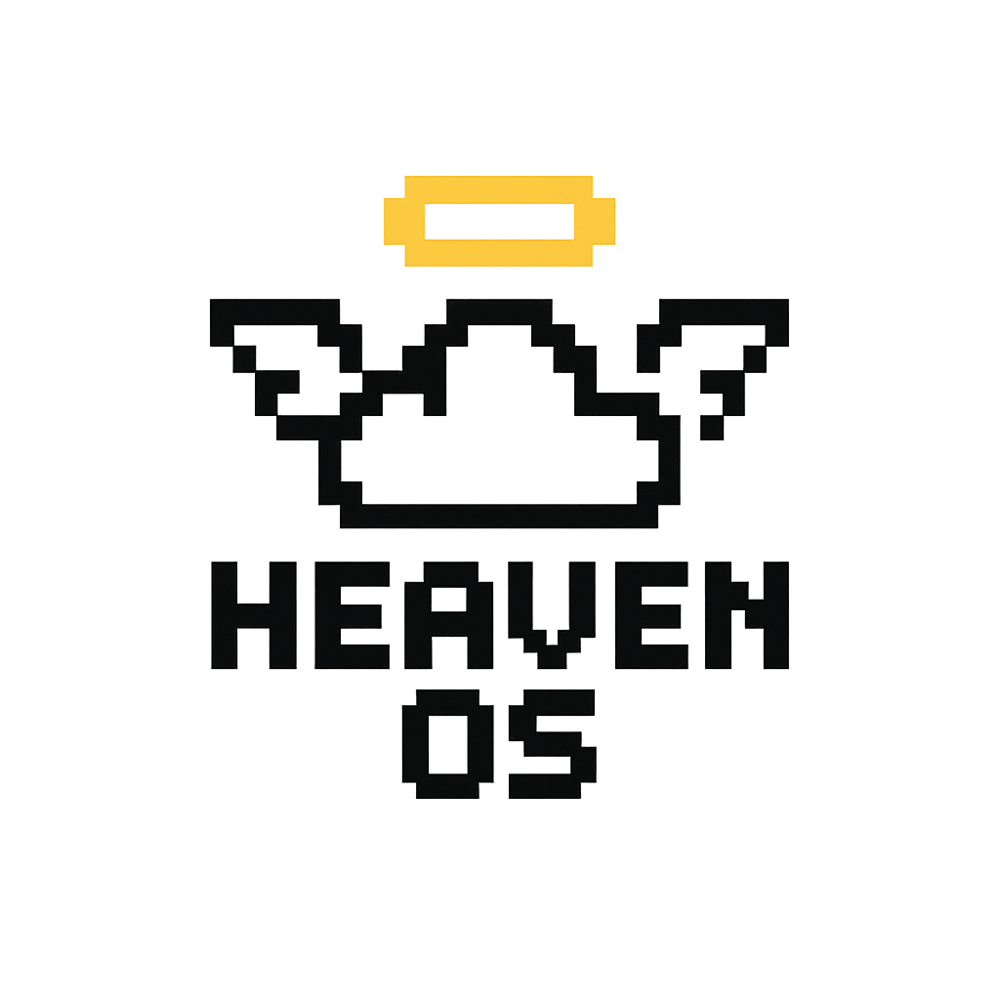

# Heaven OS

> Boot to clouds. Work in pixels.

A retro pixel operating system website built with Next.js and Tailwind CSS. Experience computing the way it was meant to be - with intention, beauty, and pixel-perfect design.



## 🌟 Features

- **Heaven Prompt** - Command palette that responds instantly (Ctrl/⌘-K)
- **Halo Bar** - Essential actions at your fingertips
- **Cloud Desk** - Draggable pixel windows with authentic feel
- **Quiet Mode** - Monochrome focus theme for distraction-free work
- **CRT Effect** - Optional scanline overlay for authentic retro feel
- **8-bit Sound Effects** - Authentic bleeps and bloops (with mute toggle)
- **Pixel Perfect** - Every element crafted with 1-2px borders and hard edges
- **Accessibility First** - Semantic HTML, focus styles, and reduced motion support

## 🚀 Quick Start

### Prerequisites

- Node.js 18+ 
- npm or yarn

### Installation

```bash
# Clone the repository
git clone https://github.com/heavenos/heavenos.git
cd heavenos

# Install dependencies
npm install

# Start development server
npm run dev
```

Open [http://localhost:3000](http://localhost:3000) to view the website.

### Build for Production

```bash
# Build the application
npm run build

# Start production server
npm start
```

## 🎨 Design System

### Colors

- **Background**: `#ffffff` (Pure white)
- **Foreground**: `#000000` (Pure black)  
- **Halo Gold**: `#f5c84b` (Accent color)
- **Pixel Border**: `#000000` (Hard borders)

### Typography

- **Primary Font**: Press Start 2P (pixel perfect)
- **Secondary Font**: VT323 (monospace terminal)
- **Font Loading**: Local WOFF2 files for optimal performance

### Components

- **Pixel Borders**: 1-2px solid borders with hard edges
- **Pixel Shadows**: 2px offset shadows for depth
- **Pixel Buttons**: Interactive elements with hover states
- **Pixel Windows**: Draggable containers with title bars

## 🎯 Performance

The website is optimized for maximum performance:

- **Lighthouse Score**: ≥ 95 on all metrics
- **Local Fonts**: WOFF2 files served from `/public/fonts/`
- **Image Optimization**: Next.js Image component with `image-rendering: pixelated`
- **No External Dependencies**: Self-contained for fast loading
- **Semantic HTML**: Proper markup for accessibility and SEO

## 🎮 Interactive Features

### Command Palette
Press `Ctrl/⌘-K` to open the Heaven Prompt. Available commands:
- `help` - Show available commands
- `about` - Learn about Heaven OS
- `features` - List all features
- `time` - Show current time
- `weather` - Check the digital weather
- `clear` - Clear the terminal

### Sound Effects
Toggle 8-bit sound effects with the sound button. Sounds include:
- **Click**: Button interactions
- **Hover**: Element highlights  
- **Success**: Positive feedback
- **Error**: Warning notifications

### CRT Effect
Toggle authentic CRT scanlines for the full retro experience. Automatically disabled for users with `prefers-reduced-motion`.

## 📁 Project Structure

```
heavenos/
├── public/
│   ├── assets/
│   │   └── logo.png          # Heaven OS logo
│   └── fonts/
│       ├── press-start-2p.woff2
│       └── vt323.woff2
├── src/
│   ├── app/
│   │   ├── globals.css       # Global styles & pixel theme
│   │   ├── layout.tsx        # Root layout
│   │   └── page.tsx          # Main page
│   ├── components/
│   │   ├── Header.tsx        # Navigation bar
│   │   ├── Hero.tsx          # Hero section
│   │   ├── Features.tsx      # Features grid
│   │   ├── Demo.tsx          # Interactive demo
│   │   ├── Footer.tsx        # Footer links
│   │   ├── CommandPalette.tsx # Command interface
│   │   ├── CRTToggle.tsx     # CRT effect toggle
│   │   └── SoundToggle.tsx   # Sound control
│   └── hooks/
│       └── useSound.ts       # Sound effects hook
├── tailwind.config.ts        # Tailwind configuration
└── package.json
```

## 🛠️ Development

### Available Scripts

- `npm run dev` - Start development server with Turbopack
- `npm run build` - Build for production  
- `npm start` - Start production server
- `npm run lint` - Run ESLint

### Adding New Features

1. **Components**: Add to `/src/components/`
2. **Styles**: Extend `/src/app/globals.css` 
3. **Hooks**: Add to `/src/hooks/`
4. **Assets**: Place in `/public/assets/`

### Pixel Design Guidelines

- Use 1-2px borders consistently
- Maintain hard edges (no border-radius)
- Apply `image-rendering: pixelated` to images
- Use the defined color palette
- Test with CRT effect enabled

## 🌐 Deployment

### Vercel (Recommended)

```bash
# Install Vercel CLI
npm i -g vercel

# Deploy
vercel
```

### Other Platforms

The app works on any platform that supports Next.js:

- **Netlify**: Use the Next.js build plugin
- **Railway**: Connect your GitHub repository  
- **Docker**: Use the included Dockerfile (if added)

## 🤝 Contributing

We welcome contributions! Please:

1. Fork the repository
2. Create a feature branch
3. Follow the pixel design guidelines
4. Test accessibility features
5. Submit a pull request

## 📄 License

MIT License - see [LICENSE](LICENSE) for details.

## 🙏 Acknowledgments

- **Press Start 2P** font by CodeMan38
- **VT323** font by Peter Hull
- Inspired by classic 8-bit operating systems
- Built with ❤️ and pixels

---

**Heaven OS** - Where every pixel has purpose and every interaction feels intentional.

[Website](https://heavenos.com) • [GitHub](https://github.com/heavenos/heavenos) • [Twitter](https://twitter.com/heavenos)